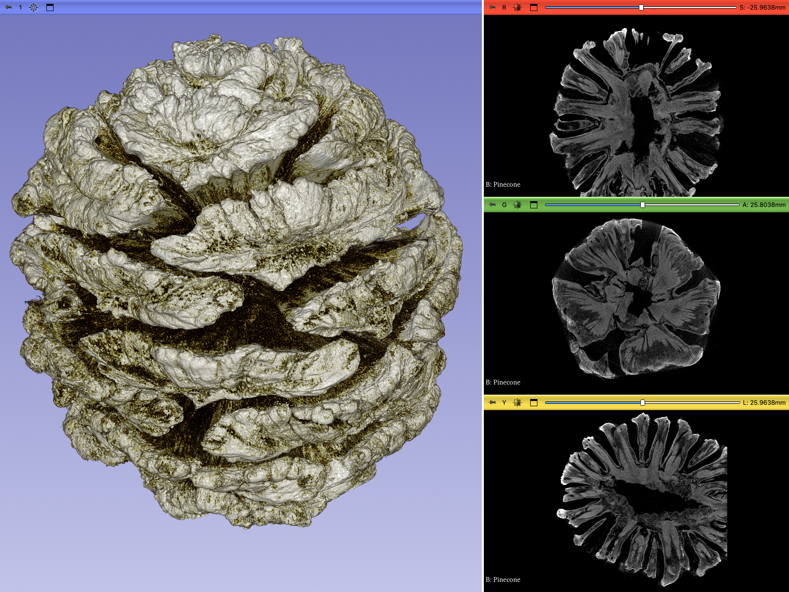

## MorphoDepot Repository
Repository for segmentation of a specimen scan.  See [this JSON file](MorphoDepotAccession.json) for specimen details.
* Species: Pinus ponderosa
* Modality: Micro CT (or synchrotron)
* Contrast: Yes
* Dimensions: (1300, 1300, 1290)
* Spacing (mm): (0.04000584, 0.04000584, 0.04000584)

## Screenshots

